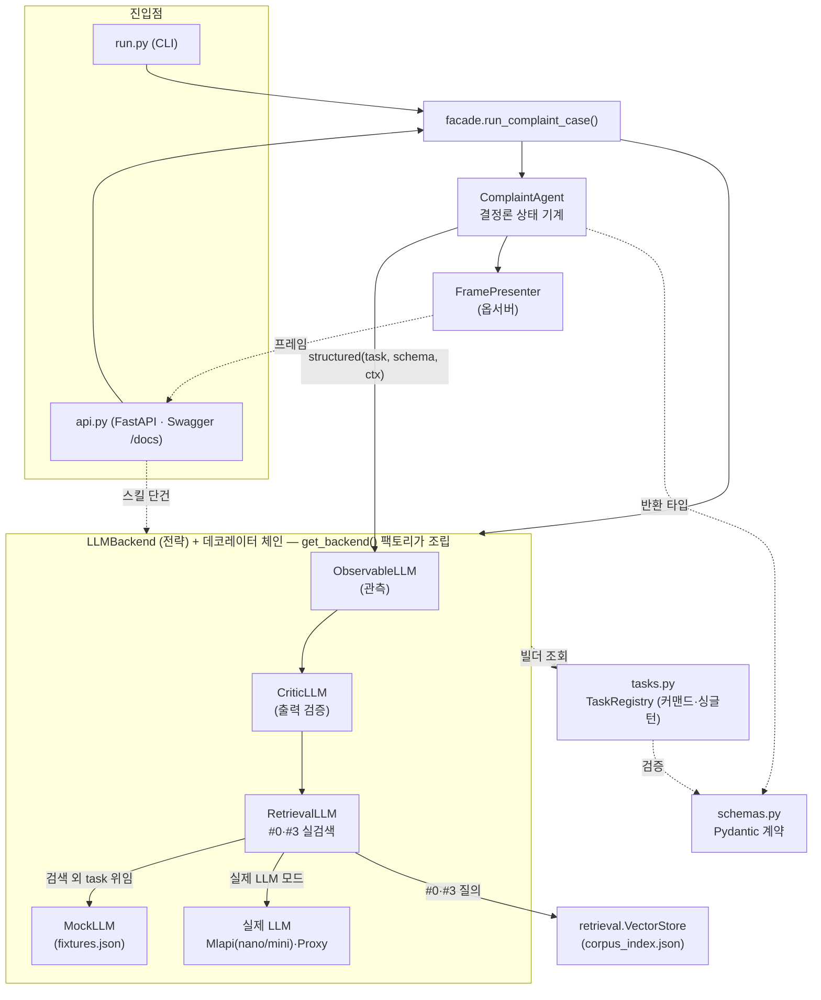
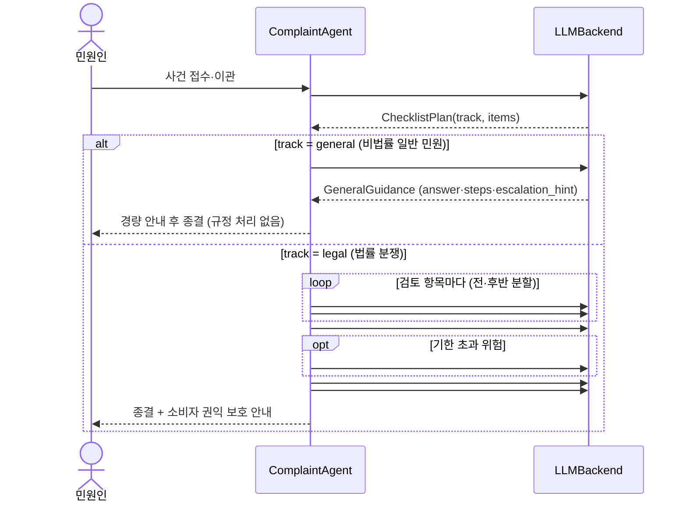

# 아키텍처 개요

> 한 줄 정의: **"에이전트가 일하는 콘솔"에서 정말로 LLM이 판단·작문해야 하는 자리만 실제
> 코드로 뽑아낸 것.** 그 외(사건 생성·원장·상태 전이·기한 계산·완결성 게이트·프레임 스냅샷)는
> 전부 결정론적 오케스트레이션이다. 즉 **결정론 상태 기계 ↔ LLM 판단**을 깔끔히 분리했다.

관련: [README](../README.md) · [SKILLS](SKILLS.md) · [DIFFERENTIATION](DIFFERENTIATION.md) ·
[refactoring(패턴)](refactoring/README.md) · [critic-verification](critic-verification.md)

## 설계 원칙

1. **계약 우선(schema-first)** — `schemas.py`의 Pydantic 모델이 LLM 입출력 계약이다. 오케스트레이터도
   API도 이 계약에만 의존하므로, 더미(MockLLM) ↔ 실제 LLM 교체가 `agent.py` 수정 없이 일어난다.
2. **의존은 한 방향** — `agent.py`는 `LLMBackend` 인터페이스와 `schemas.py`만 알고, 구체 백엔드(Mock/실제)를
   모른다. `llm.py`는 `agent.py`의 상태 전이를 모른다.
3. **에이전트는 자문·중재만** — 새 기한(#4)·권리 행사(#6)는 *권고·안내*까지. 확정은 사람이 한다.
4. **additive 확장** — 웹 API(#Phase1)·권익 안내(#6)·트리아지(#7)는 기존 계약을 깨지 않고 얹었다.

## 컴포넌트 구성

- 데코레이터 체인은 바깥→안: `ObservableLLM(CriticLLM(RetrievalLLM(base)))` (플래그에 따라 조립,
  `RetryingLLM`/`CachingLLM`도 선택). 감싸도 출력은 동일하다(관측·검증은 부수효과).
- `RetrievalLLM`은 `#0 checklist_plan`·`#3 similar_cases`만 실제 벡터 검색으로 처리하고 나머지는 base에 위임.
- 상세 패턴 근거는 [refactoring/README](refactoring/README.md), Critic 4단계는 [critic-verification](critic-verification.md).

## 처리 플로우 (트리아지 분기 포함)

결정론 구간(LLM 아님): 사건 생성·이력 개시·원장 append·상태 전이·처리 기한 계산·완결성 게이트
(`_remaining()==0`)·프레임 스냅샷(`emit`). 전부 `agent.py`가 담당.

## 레이어 / 파일

| 레이어 | 파일 | 역할 | 패턴 |
|---|---|---|---|
| 계약 | [`schemas.py`](../schemas.py) | LLM 입출력 Pydantic 모델(+`track`·`ConsumerRightsGuide`·`GeneralGuidance`) | 값 객체 |
| 상태 기계 | [`agent.py`](../agent.py) | 오케스트레이션 — 언제 LLM을 부를지 | Subject |
| 뷰 | [`presentation.py`](../presentation.py) | 상태 스냅샷 → viewer 프레임 | 옵서버 |
| 백엔드 | [`llm.py`](../llm.py) | `LLMBackend`(전략) + `get_backend`(팩토리) + `RetrievalLLM` | 전략·팩토리 |
| 스킬 정의 | [`tasks.py`](../tasks.py) | task별 프롬프트/더미 빌더 + `classify_track` | 커맨드·싱글턴 |
| 횡단 관심 | [`decorators.py`](../decorators.py) | 관측·재시도·캐시·Critic | 데코레이터 |
| 검증 | [`critic.py`](../critic.py) | 출력을 근거에 대조(할루시네이션) | 전략 |
| RAG | [`retrieval.py`](../retrieval.py) | 청킹·메타·VectorStore·유사사례 조립 | 전략 |
| 진입 | [`facade.py`](../facade.py) | 케이스→백엔드→에이전트→실행 배선 | 퍼사드 |
| 웹 | [`api.py`](../api.py) | FastAPI + Swagger, 파이프라인/스킬 HTTP 노출 | (Phase1 추가) |

## 프레임(뷰) 데이터

`FramePresenter.capture()`가 매 `emit`마다 에이전트 상태를 dict로 스냅샷한다. 주요 키:
`status`·`classification`·**`track`**·`checklist`·`ledger`·`history`·`disclose_u`/`disclose_r`·
`vector`·`nego_state`·`risk`·**`rights_guide`**·**`general_guidance`**·`phase_ko`/`hop`.
이 프레임 배열이 `frames.json`(정적) 또는 `GET /api/frames`(라이브)로 `viewer.html`에 들어간다.
